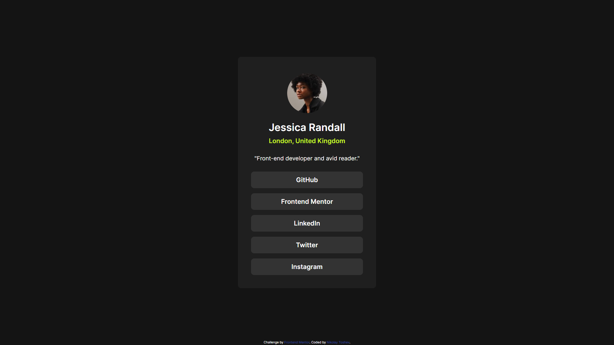

# Frontend Mentor - Social links profile solution

This is a solution to the [Social links profile challenge on Frontend Mentor](https://www.frontendmentor.io/challenges/social-links-profile-UG32l9m6dQ). Frontend Mentor challenges help you improve your coding skills by building realistic projects.

## Table of contents

-   [Overview](#overview)
    -   [The challenge](#the-challenge)
    -   [Screenshot](#screenshot)
    -   [Links](#links)
-   [My process](#my-process)
    -   [Built with](#built-with)
    -   [What I learned](#what-i-learned)
    -   [Continued development](#continued-development)
-   [Author](#author)
-   [Acknowledgments](#acknowledgments)

## Overview

Simple profile card with hover effect.

### The challenge

Users should be able to:

-   See hover and focus states for all interactive elements on the page

### Screenshot

### Links

-   Solution URL: [GitHub link to the code](https://github.com/gilotin/Social-links-profile)
-   Live Site URL: [live site uploaded in Vercel](https://social-links-profile-v2.vercel.app/)

## My process

1. Analyzing the task.
2. Structure the HTML and naming the classes.
3. Adding external lins (in needed).
4. Creating style.css,
   5.Testing and fixing the bugs.

### Built with

-   Semantic HTML5 markup
-   CSS
-   BEM methodology
-   Flexbox
-   Desktop-first workflow

### What I learned

I learned how to properly center a card and making hover effect.

### Continued development

I'm currently focused on practicing HTML and CSS with BEM methodology.

## Author

-   Linkedin - [Nikolay Toshev](https://www.linkedin.com/in/nikolay-toshev-5536a025b/)
-   Frontend Mentor - [@gilotin](https://www.frontendmentor.io/profile/gilotin)
-   GitHub - [@gilotin](https://github.com/gilotin/Social-links-profile)

## Acknowledgments

I want to thank my family, friends and the whole internet community for helping me to become a better programmer.
